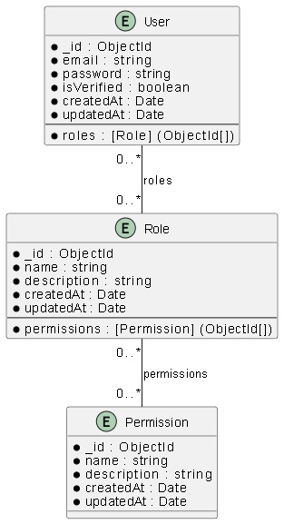
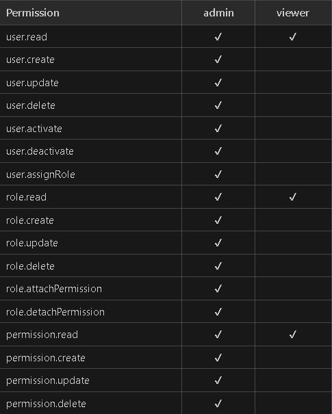

# Users & Permissions Management Dashboard

## Stack technique
- **Frontend** : React + TypeScript, TailwindCSS
- **Backend** : Express.js + TypeScript
- **Database** : MongoDB

## Fonctionnalités principales
- Authentification (JWT) : login, logout, inscription, reset password
- RBAC : utilisateurs, rôles, permissions, UI & API gating
- CRUD complet : utilisateurs, rôles, permissions (avec pagination, recherche, assignation)
- Sécurité : validation, rate-limit, API protégée, JWT, .env sécurisé (dans `.gitignore`)

## Livrables fournis
- **Vidéo démo** (explicative, 4min) : [Lien Google Drive](https://drive.google.com/file/d/1IDlvNMbuIFfQAhIgdBNT96t284kEIPJ2/view?usp=drive_link)  

- **Diagramme data model** :  
    

- **Matrice rôles/permissions** :  
    

- **.env** : non inclus pour sécurité
- **API docs** : à tester avec Postman (voir ci-dessous)

## Tests API
- Les tests doivent être faits avec Postman (collection non sauvegardée)
- Si besoin, je peux expliquer comment tester toutes les routes lors de l'entretien 

## Structure du repo
- `frontend/` : code React
- `backend/` : code Express/Mongo
- `diagramme.png` : diagramme du modèle de données
- `matrix.png` : matrice des rôles/permissions
